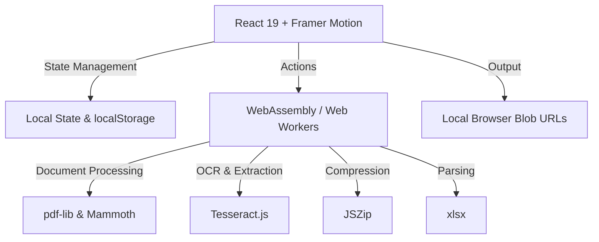

<div align="center">
  
  # 🛠️ Utilify
  
  ### *A Premium, Developer-Focused, 100% Client-Side Web Utility Suite*
  
  [](https://opensource.org/licenses/MIT)
  [](https://vite.dev)
  [](https://react.dev)
  [](https://www.typescriptlang.org)
  [](#-privacy-first-architecture)

  [Overview](#-overview) • [Key Features](#-key-features) • [Tool Categories](#-tool-categories) • [Tech Stack](#-technology-stack) • [Quick Start](#-quick-start) • [Architecture](#-architecture--design)

</div>

---

## 🌟 Overview

**Utilify** is a professional, high-fidelity browser-based workspace containing over 60 utility tools tailored for developers, designers, and power users. Unlike traditional online utility suites that upload your private files, documents, and credentials to remote servers, **Utilify operates entirely client-side**, guaranteeing absolute data privacy and sub-millisecond execution times.

---

## 🔒 Privacy-First Architecture

Utilify processes all files, passwords, images, and data packets locally inside the browser sandbox:
*   **Zero Server Uploads**: No external API endpoints are touched during document parsing, image extraction, or cryptographic functions.
*   **WASM & Web APIs**: Heavy workloads (like OCR text recognition and PDF manipulation) are executed inside isolated Web Workers using compiled WebAssembly binaries.
*   **Blob URLs**: Output buffers and processed files are loaded into local browser memory as Object Blobs, which are automatically revoked upon tab destruction to prevent memory leakage.

---

## ✨ Key Features

*   **⚡ Sub-Millisecond Speed**: Runs on React 19 and Vite for lighting-fast component mounts and real-time state changes.
*   **Procedural Step Wizards**: Documents tools (Word to PDF, Word to TXT, etc.) guide users through a clean, stepwise path: **Upload ➔ Convert ➔ Download**.
*   **Two-Column PDF Workspace**: PDF tools (Merger & Splitter) are partitioned into an Input control panel on the left and Output file queues / action controls on the right.
*   **Filename Prompts & Progress Bars**: User-configurable naming dialogs and responsive animated progress loading bars for long-running batches.
*   **Glassmorphic Design**: Clean black, green, white, and blue visual token palette with smooth hover transitions, card glows, and dark-mode support.
*   **Launch History Tracker**: Logs your last 24 launched tools using browser-local storage, letting you quickly re-open tools from the **History** tab.

---

## 📁 Tool Categories

Utilify divides its 60+ utilities into dedicated modules:

| Category | Primary Tools | Core Libraries / APIs |
| :--- | :--- | :--- |
| **📄 Documents & PDF** | Word/Excel/PowerPoint to PDF, PDF Merger & Splitter, Image to PDF, OCR Image-to-Text, ZIP Compressor | `pdf-lib`, `mammoth`, `xlsx`, `jszip`, `tesseract.js` |
| **🎨 Image & Design** | Background Remover, Favicon Generator, Image Resizer & Compressor, Canvas Logo Generator, Meme Creator | Canvas API, `browser-image-compression` |
| **🔐 Security & Crypto**| Hash Generator (MD5, SHA), Password Strength Analyser, IP/VPN Lookup, Local Password Generator | `crypto-js`, `zxcvbn-ts` |
| **💻 Developer Utilities**| API Tester, JSON Formatter & Validator, Code Minifier (HTML/CSS/JS), Regex Parser, Code Beautifier | `js-beautify`, Fetch API |
| **🔍 Scanners & Codes** | Barcode/QR Code Generator, Custom QR Styler, Secure Encrypted QR Scanner, vCard Maker | `qrcode.react`, `html5-qrcode` |
| **⚙️ Miscellaneous** | Random Fake Data Generator, Monospace Text Case Converter, Morse Code Translator, Dice/Number Generator | `@faker-js/faker` |

---

## 🛠️ Technology Stack



*   **Build Pipeline**: Vite + TypeScript + ESLint
*   **UI Components**: React 19 (Functional Hooks + Memoization)
*   **Interactions**: Framer Motion 12
*   **Styling**: Raw Vanilla CSS Custom Properties (Tokens)
*   **Core Libraries**: `pdf-lib`, `jszip`, `xlsx`, `tesseract.js`, `mammoth`, `crypto-js`, `qrcode.react`

---

## 🚀 Quick Start

### Prerequisites
*   Node.js (v18.0.0 or higher)
*   npm (v9.0.0 or higher)

### Installation

1.  **Clone the repository** (if setting up on a new environment):
    ```bash
    git clone https://github.com/Mwenda-Boniface/Utilify.git
    cd Utilify
    ```

2.  **Install dependencies**:
    ```bash
    npm install
    ```

3.  **Launch the local development server**:
    ```bash
    npm run dev
    ```
    *Open [http://localhost:5173](http://localhost:5173) in your browser.*

4.  **Build production artifacts**:
    ```bash
    npm run build
    ```
    *The optimized build output will be placed in the `/dist` folder.*

---

## 📄 License

This project is licensed under the **MIT License** - see the [LICENSE](LICENSE) file for details.

---

<div align="center">
  <sub>Built with ❤️ locally inside your browser sandbox. 100% Secure. 100% Private.</sub>
</div>
