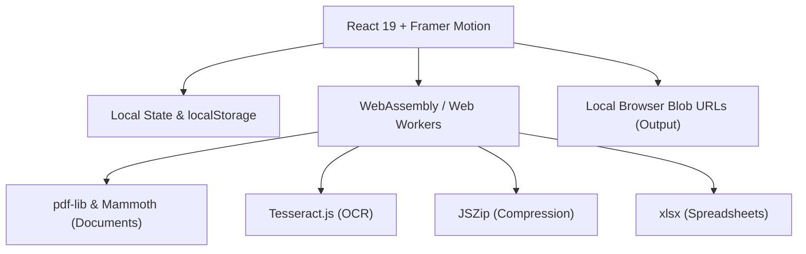

<div align="center">

  

  # Utilify — Free Online Utility Tools

  ### *60+ Browser-Based Tools for Developers, Designers & Everyday Tasks*

  [](https://www.utilifytools.dpdns.org)
  [](https://opensource.org/licenses/MIT)
  [](#️-privacy-first-no-server-uploads)

  [](https://react.dev)
  [](https://www.typescriptlang.org)
  [](https://vite.dev)
  [](https://github.com/Mwenda-Boniface/Utilify)
  [](https://github.com/Mwenda-Boniface/Utilify)

  [🌐 Live Demo](https://www.utilifytools.dpdns.org) • [✨ Features](#-key-features) • [🧰 All 60+ Tools](#-complete-tool-list) • [🚀 Quick Start](#-quick-start) • [🏗️ Tech Stack](#️-technology-stack) • [🤝 Contributing](#-contributing)

</div>

---

## 🔍 What is Utilify?

**Utilify** is a free, open-source, browser-based utility suite with **60+ productivity tools** for developers, designers, students, and everyday users. Every single operation — from PDF conversion to password generation to QR code creation — runs **entirely inside your browser**. No files ever leave your device. No account needed. No cost.

> 🔗 **Try it now:** [www.utilifytools.dpdns.org](https://www.utilifytools.dpdns.org)

**Search keywords:** free online tools, browser utility suite, developer tools online, PDF converter free, QR code generator, password generator, image resizer, OCR text extractor, file converter, no upload tools, privacy-first tools, open source utilities

---

## ✨ Key Features

- **🔒 100% Private** — All processing happens in your browser. Zero file uploads, zero tracking of your data.
- **⚡ Instant & Fast** — Built on React 19 + Vite with code-splitting. Tools load on-demand in milliseconds.
- **📦 60+ Tools in One Place** — QR codes, PDF conversion, image editing, password security, developer utilities, calculators, encoders, and more — all in a single app.
- **🗂️ Unified Dashboard Hub** — A brand new Home portal organizing everything into distinct suites: Local Tools, Software Downloads, Developer Platforms, and No Sign-up Web Apps.
- **💻 Expansive Developer Resources** — 24 dedicated development categories covering everything from IDEs and CI/CD pipelines to Game Engines and AI platforms.
- **🌐 Curated External Repositories** — Extensive links to free software hubs, ad-blocking tools, free AI models, and zero-login resources.
- **📱 Responsive Design** — Works seamlessly across devices, featuring a smart sticky header and bottom-mobile navigation.
- **🌙 Dark Mode First** — Premium glassmorphic dark UI with smooth animations and clean visual design.
- **🧠 No Sign-Up Required** — Open the site, use any tool, done. No registration, no email, no subscription.
- **📖 Launch History** — Your last 24 launched tools are automatically remembered locally for quick re-access.
- **🆓 Completely Free & Open Source** — MIT licensed. Fork it, extend it, self-host it.

---

## 🧰 Complete Tool List

### 🔐 Security & Privacy
| Tool | Description |
|------|-------------|
| **Password Generator** | Create ultra-secure random passwords with custom length & character rules |
| **Password Strength Checker** | Analyze password entropy, complexity, and crack-time estimation |
| **Hash Generator** | Generate MD5, SHA-1, SHA-256, SHA-512 cryptographic hashes |
| **IP Address Lookup** | Geolocate and analyze any IPv4 or IPv6 address |
| **VPN / Proxy Detector** | Detect if an IP address belongs to a VPN, proxy, or TOR exit node |

### 🔢 Calculators
| Tool | Description |
|------|-------------|
| **Age Calculator** | Precise age calculation down to minutes and seconds |
| **BMI Calculator** | Calculate Body Mass Index with health range indicators |
| **Loan Calculator** | Monthly payment, total interest, and amortization schedule |
| **Currency Converter** | Real-time exchange rates for 150+ global currencies |
| **Percentage Calculator** | Simple and compound percentage operations |
| **Time Zone Converter** | Sync and compare times across multiple global time zones |
| **GPA Calculator** | Calculate cumulative GPA from course grades and credits |

### 🖼️ Image & Design
| Tool | Description |
|------|-------------|
| **Background Remover** | AI-powered automatic background extraction from images |
| **Image Compressor** | Reduce file size without visible quality loss |
| **Image Resizer** | Resize images to any dimension for any platform |
| **Meme Generator** | Create memes from popular templates or custom images |
| **Thumbnail Maker** | Design high-click-rate YouTube and social media thumbnails |
| **Color Picker** | HEX, RGB, HSL color converter and browser-based picker |
| **Logo Generator** | Quick AI-assisted logo concept generation for projects |
| **Favicon Generator** | Generate multi-size favicons from any image or text |

### 📄 File & Document
| Tool | Description |
|------|-------------|
| **PDF Merger & Splitter** | Combine multiple PDFs or extract individual pages |
| **Image to PDF** | Convert collections of images (JPG, PNG, WebP) to a PDF |
| **OCR — Image to Text** | Extract editable text from images using AI recognition |
| **Text to Speech** | Convert written text to natural-sounding audio |
| **Speech to Text** | Transcribe spoken voice into editable text in real time |
| **ZIP Compressor** | Create and extract ZIP archives entirely in-browser |
| **Word to PDF** | Convert `.docx` Word files to PDF |
| **Word to TXT** | Extract plain text content from Word documents |
| **Excel to PDF** | Convert spreadsheets to PDF format |
| **Excel to Word** | Convert Excel tables into a formatted Word document |
| **PDF to Image** | Convert PDF pages to high-quality PNG images |
| **PDF to Word** | Convert PDF content into an editable `.docx` Word file |
| **PDF to Excel** | Extract PDF tables directly into an Excel spreadsheet |
| **PDF to PowerPoint** | Convert PDF pages into editable PowerPoint slides |
| **PowerPoint to PDF** | Convert `.pptx` presentations to PDF |

### 🔍 SEO & Website Tools
| Tool | Description |
|------|-------------|
| **Keyword Density Checker** | Analyze keyword frequency and density in any content |
| **Meta Tag Generator** | Generate complete SEO meta tags for any web page |
| **XML Sitemap Generator** | Create XML sitemaps for search engine indexing |
| **Robots.txt Generator** | Configure search engine crawler access rules |
| **Website Speed Checker** | Check site performance metrics and load times |
| **WHOIS Lookup** | Query domain registration and ownership information |

### 👨‍💻 Developer Utilities
| Tool | Description |
|------|-------------|
| **JSON Formatter & Validator** | Pretty-print, validate, and clean messy JSON code |
| **Code Minifier** | Compress and minify HTML, CSS, and JavaScript files |
| **Code Beautifier** | Auto-format and indent code for readability |
| **Regex Tester** | Test and debug regular expressions with live match highlighting |
| **API Tester** | Basic REST API testing — send GET, POST, PUT, DELETE requests |

### 📷 Scanners & QR / Barcode
| Tool | Description |
|------|-------------|
| **QR Code Generator** | Create dynamic and static QR codes with custom content |
| **QR Code Scanner** | Scan QR codes live from your camera or an uploaded file |
| **Batch QR Scanner** | Scan multiple QR codes at once for inventory workflows |
| **Barcode Generator** | Generate EAN-13, UPC-A, Code-128, and more barcodes |
| **Barcode Scanner** | Read and decode 1D barcodes using your camera |
| **WiFi QR Code** | Create QR codes that connect devices to a WiFi network |
| **vCard QR Generator** | Share contact card details instantly via a scannable QR |
| **Email/SMS QR** | Create QR codes that open pre-filled email or SMS messages |
| **Event QR Generator** | Add calendar events to phones via a scannable QR code |
| **Bulk QR Generator** | Generate hundreds of QR codes from a CSV data upload |
| **Barcode Converter** | Convert between EAN, UPC, and checksum formats |
| **QR Code Customizer** | Add branding, logos, colors, and premium styles to QR codes |
| **QR Code Validator** | Perform technical analysis and error-correction grading |
| **QR Code Tracker** | Track local scan frequency and usage analytics |
| **Editable QR Hub** | Manage dynamic links and local redirects via a QR hub |
| **Image QR Scanner** | Decode QR codes from saved image files |

### 🔡 Encoders & Decoders
| Tool | Description |
|------|-------------|
| **Base64 Encoder/Decoder** | Encode and decode Base64 strings instantly |
| **Binary Converter** | Convert text to and from 0/1 binary sequences |
| **URL Encoder/Decoder** | Safe URL encoding and decoding for query strings |
| **Morse Code Translator** | Convert text to Morse code and back |
| **HTML Entities Encoder** | Escape and unescape HTML special characters safely |

### 🎲 Miscellaneous
| Tool | Description |
|------|-------------|
| **Dice Generator** | Random number roller and multi-sided dice simulator |
| **Fake Data Generator** | Generate mock data (names, addresses, emails) for testing |
| **Name Generator** | Generate random, realistic names for any nationality |
| **Password List Generator** | Bulk-generate hundreds of secure passwords at once |
| **Case Converter** | Convert text between UPPER, lower, camelCase, snake_case |

---

## 🛡️ Privacy-First — No Server Uploads

Utilify processes **everything locally** inside your browser sandbox:

- **Zero Server Uploads** — No external APIs are called during document parsing, image extraction, or cryptographic operations.
- **WebAssembly Workers** — Heavy tasks (OCR, PDF manipulation) run inside isolated Web Workers using compiled WASM binaries.
- **Blob URLs** — Output files are created as in-memory Blob URLs that are automatically revoked when you leave, preventing memory leaks.
- **No Telemetry on Your Files** — Google Analytics tracks page views only (standard analytics), never your file contents or tool inputs.

---

## 🏗️ Technology Stack



| Layer | Technology |
|-------|-----------|
| **Frontend Framework** | React 19 (Functional Hooks, `React.lazy`, `Suspense`) |
| **Language** | TypeScript 5 |
| **Build Tool** | Vite 8 with ESNext target and code-splitting |
| **Styling** | Vanilla CSS Custom Properties (Design Tokens) |
| **Animations** | Framer Motion 12 |
| **PDF Processing** | `pdf-lib`, `mammoth`, `jspdf`, `pdfjs-dist` |
| **OCR** | `tesseract.js` |
| **Compression** | `jszip`, `browser-image-compression` |
| **QR & Barcodes** | `qrcode.react`, `html5-qrcode`, `jsbarcode` |
| **Security** | `crypto-js`, `zxcvbn-ts` |
| **Spreadsheets** | `xlsx` (SheetJS) |
| **Fake Data** | `@faker-js/faker` |

---

## 🚀 Quick Start

### Prerequisites
- Node.js **v18.0.0** or higher
- npm **v9.0.0** or higher

### Installation

```bash
# 1. Clone the repository
git clone https://github.com/Mwenda-Boniface/Utilify.git
cd Utilify

# 2. Install dependencies
npm install

# 3. Launch the development server
npm run dev
# Open http://localhost:5173 in your browser
```

### Build for Production

```bash
npm run build
# Optimized output placed in /dist
```

### Self-Hosting

Since Utilify produces a static `/dist` bundle, you can host it on:
- **GitHub Pages** — free, zero-config
- **Netlify / Vercel** — free tier with auto-deploy from GitHub
- **Any static web server** — Apache, Nginx, Caddy, etc.

---

## 📁 Project Structure

```
Utilify/
├── public/               # Static assets (favicon, robots.txt, sitemap.xml, llms.txt)
├── src/
│   ├── assets/           # Images and static resources
│   ├── hooks/            # Custom React hooks (useTheme, etc.)
│   ├── components/       # Reusable components (e.g., interactive dropdown Menus)
│   ├── layout/           # App shell — header, sticky nav, mobile navigation
│   ├── pages/            # Page-level components
│   │   ├── home/         # Unified Dashboard entry point
│   │   ├── software/     # Curated software download hubs
│   │   ├── development/  # 24+ Developer resource categories
│   │   ├── nosignups/    # Free, no-signup web apps & external resources
│   │   ├── [tool categories...]/ # Core 60+ offline browser utilities
│   └── styles/           # Global CSS design tokens (theme.css)
├── index.html            # App entry point with SEO meta tags
├── vite.config.ts        # Vite build configuration
└── package.json
```

---

## 🤝 Contributing

Contributions, bug reports, and feature requests are very welcome!

1. **Fork** the repository
2. **Create a branch**: `git checkout -b feature/new-tool-name`
3. **Commit your changes**: `git commit -m "feat: add new tool"`
4. **Push to the branch**: `git push origin feature/new-tool-name`
5. **Open a Pull Request** on GitHub

Please check the [open issues](https://github.com/Mwenda-Boniface/Utilify/issues) for ideas or to report bugs.

---

## 📄 License

This project is licensed under the **MIT License** — free for personal and commercial use. See the [LICENSE](LICENSE) file for full terms.

---

<div align="center">

  ### 🌐 [www.utilifytools.dpdns.org](https://www.utilifytools.dpdns.org)

  **Utilify** — Free Online Utility Tools • Open Source • No Sign-Up • Privacy First

  *PDF Converter • QR Code Generator • Password Generator • Image Resizer • OCR Tool*
  *Base64 Encoder • JSON Formatter • Barcode Generator • File Converter • Developer Tools*

  [](https://github.com/Mwenda-Boniface/Utilify)
  [](https://github.com/Mwenda-Boniface/Utilify)

  <sub>Copyright © 2026 <a href="https://github.com/Mwenda-Boniface">Mwenda Boniface</a>. MIT Licensed.</sub>
  <sub>Built with ❤️ — 100% client-side. Your files never leave your browser.</sub>

</div>
